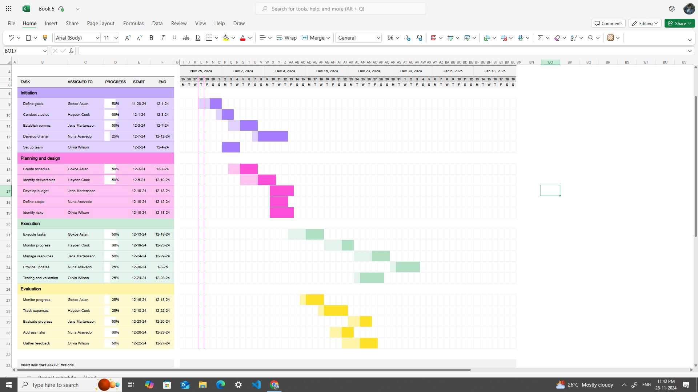

# Software Project Documentation

This document aligns the software project lifecycle processes with a **Waterfall Gantt Chart** framework. It outlines the purpose, implementation, and deliverables for each phase and task, ensuring clarity, alignment, and structured execution.

---

## **Initiation Phase**

The initiation phase ensures that foundational elements are established to set the project up for success. Key tasks include **Defining Goals**, **Conducting Studies**, **Establishing Communication**, **Developing the Charter**, and **Setting Up the Team**.

### **1. Define Goals**
#### **Purpose**
Establish actionable, measurable objectives aligned with organizational priorities.

#### **Steps Involved**
1. **Stakeholder Engagement**:
   - Consult stakeholders to understand business needs.
   - Identify key outcomes that align with organizational goals.
2. **Scope Definition**:
   - Define project boundaries, including inclusions and exclusions.
3. **SMART Goals Framework**:
   - Use SMART criteria (Specific, Measurable, Achievable, Relevant, Time-bound).
4. **Document Objectives**:
   - Consolidate goals into a formal document for stakeholder approval.

#### **Deliverables**
- [Project Goals Document](./template/Project%20Goals%20Document.md)
- [Stakeholder Approval Sign-Off](./template/Stakeholder%20Approval%20Sign-Off.md)

---

### **2. Conduct Studies**
#### **Purpose**
Validate feasibility, requirements, and risks through research and analysis.

#### **Steps Involved**
1. **Feasibility Study**:
   - Assess technical, operational, and economic feasibility.
2. **Requirement Analysis**:
   - Gather detailed requirements using interviews, surveys, and workshops.
3. **Risk Assessment**:
   - Identify and mitigate potential risks.
4. **Market and Competitor Analysis** (if applicable):
   - Research comparable solutions and evaluate market opportunities.

#### **Deliverables**
- [Feasibility Report](./template/Feasibility%20Report.md)
- [Requirements Specification Document](./template/Requirements%20Specification%20Document%20.md)
- [Risk Assessment and Mitigation Plan](./template/Risk%20Assessment%20and%20Mitigation%20Plan.md)

---

### **3. Establish Communication**
#### **Purpose**
Ensure efficient collaboration and information sharing among stakeholders and team members.

#### **Steps Involved**
1. **Identify Stakeholders**:
   - Create a comprehensive list of stakeholders.
2. **Communication Plan**:
   - Define communication frequency, format, tools, and escalation paths.
3. **Set Up Tools**:
   - Implement collaboration tools (e.g., Slack, Microsoft Teams).
4. **Define Roles**:
   - Assign roles for communication management.

#### **Deliverables**
- [Communication Plan Document](.//template/Communication%20Plan%20Document.md)
- [Stakeholder Contact List](./template/Stakeholder%20Contact%20List.md)
- [Implemented Communication Tools](./template/Implemented%20Communication%20Tools.md)

---

### **4. Develop Charter**
#### **Purpose**
Formally document project objectives, scope, stakeholders, and constraints to provide an official mandate.

#### **Steps Involved**
1. **Define Project Scope**:
   - Clearly articulate deliverables.
2. **List Stakeholders and Roles**:
   - Identify stakeholders and their responsibilities.
3. **Outline Constraints**:
   - Specify time, budget, or resource limitations.
4. **Approval Process**:
   - Secure sign-off from stakeholders.

#### **Deliverables**
- [Project Charter Document](./template/Project%20Charter.md)
- [Stakeholder Sign-Off](./template/Stakeholder%20Sign-Off%20Document.md)

---

### **5. Set Up Team**
#### **Purpose**
Assemble a skilled team aligned with project requirements.

#### **Steps Involved**
1. **Identify Required Skills**:
   - Analyze project needs and skills.
2. **Recruit Team Members**:
   - Select suitable individuals internally or externally.
3. **Assign Roles**:
   - Define team members' responsibilities (e.g., project manager, developer).
4. **Conduct Onboarding**:
   - Orient the team to goals, tools, and communication methods.
5. **Establish Team Norms**:
   - Set expectations for collaboration and deadlines.

#### **Deliverables**
- [Team Roster](./template/Team%20Roster.md)
- [Roles and Responsibilities Document](./template/Roles%20and%20Responsibilities%20Document.md)
- [Onboarding Materials](./template/Onboarding%20Materials.md)

---

## **Planning and Design Phase**

This phase focuses on preparing the project roadmap, deliverables, and resource allocation.

### **Tasks**
1. **Create Schedule**:
   - Define timelines and milestones in the Gantt chart.
2. **Identify Deliverables**:
   - Specify the outputs required from each phase.
3. **Develop Budget**:
   - Estimate costs and allocate funds.
4. **Define Scope**:
   - Finalize the scope of work, including inclusions and exclusions.
5. **Identify Risks**:
   - Document risks and mitigation strategies.

#### **Deliverables**
- **Project Schedule**
- **Deliverables List**
- **Budget Plan**
- **Scope Document**
- **Risk Mitigation Plan**

---

## **Execution Phase**

Execute the project plan, ensuring tasks are completed, resources are managed, and progress is monitored.

### **Tasks**
1. **Execute Tasks**:
   - Carry out project activities as per the plan.
2. **Monitor Progress**:
   - Track completion rates and timelines.
3. **Manage Resources**:
   - Optimize use of personnel, tools, and funds.
4. **Provide Updates**:
   - Report progress to stakeholders regularly.

#### **Deliverables**
- **Progress Reports**
- **Task Completion Logs**
- **Resource Utilization Metrics**

---

## **Testing and Validation Phase**

Assess deliverables to ensure they meet requirements and address stakeholder feedback.

### **Tasks**
1. **Evaluate Progress**:
   - Review milestones against goals.
2. **Track Expenses**:
   - Compare actual costs with budget projections.
3. **Address Risks**:
   - Update risk plans and resolve issues.
4. **Gather Feedback**:
   - Solicit stakeholder input for final adjustments.

#### **Deliverables**
- **Validation Reports**
- **Updated Risk Assessment**
- **Stakeholder Feedback Summary**

---

Each phase and task in this Waterfall Gantt chart structure builds toward project success by ensuring clarity, accountability, and systematic progress monitoring. By adhering to this framework, teams can effectively deliver high-quality outcomes.
